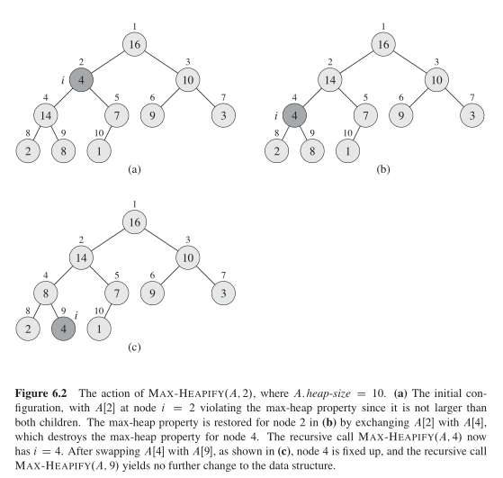

# How to implement max-priority queue?
+ The main idea is to use **heap data structure**
# Use in which scenarios ? --- job scheduler
+ based on max-heaps
+ defination: a priority queue is *data structure* for maintaining a set of
  S of elements, each with an associated value called a **key**
## support operation for max-priority queue
+ INSERT(S, x)
+ MAXIMUM(S)
+ EXTRACT-MAX(S)
+ INCREASE-KEY(S, x, k) --- increase x's key value to k

## left/right/parent relationship
```
PARENT(i)
    return floor(i/2)
LEFT(i)
    return 2*i
RIGHT(i)
    return 2*i + 1
```
## build max heap (Assuming we have n for heap-size)
```
BUILD-MAX-HEAP(A)
    A.heap-size = A.length
    for i = floor(A.length/2) downto 1
        MAX-HEAPIFY(A, i)
```
## build min heap
```
BUILD-MIN-HEAP(A)
    A.heap-size = A.length
    for i = floor(A.length/2) downto 1
        MIN-HEAPIFY(A, i)
```
## heapsort
```
HEAPSORT(A)
  BUILD-MAX-HEAP(A)
  for i = A.length downto 2
      exchange A[1] with A[i]
      MAX-HEAPIFY(A, 1)
```
## top k elements in random array with running time of O(n*logk)
```
TOPK-MAX-HEAP(A, k)
  if A.length < k
      error "heap size less than k"
  for i = 1 to k
      B[i] = A[i]
  BUILD-MIN-HEAP(B) /* So, B is a heap with k elements */

  for i = k to n /* loop for n - k times */
      if A[i] > B[1]
          exchange B[1] with A[i]
          /* min heapify */
          MIN-HEAPIFY(B) /* cost O(logk) */
  total running time: (n-k)*logk which match O(n*logk)
```
## Further discussion: if we have a max-heap with n element, how can we decrese the runing time to O(k*logk) ???
* the MAIN IDEA is: we can build another max-heap from where we can extract the biggest element
  each time, assuming original heap is T, and we can build A, whose elements are records with
  two fields: key and position(in T)
```
TOPK-MAX-HEAP(T)
  x.key = T[1]
  x.position = 1
  INSERT(A, x) /* after this, we have max heap with only A[1] */
  for i = 1 to k
      x = HEAP-EXTRACT-MAX(A)
      output x.key
      j = x.position
      /* since we have extract the biggest element, we have to insert its child and max heapify the A */
      if (2*j) <= n
          x.key = T[2*j]
          x.position = 2*j
          INSERT(A, x)
      if (2*j + 1) <= n
          x.key = T[2*j + 1]
          x.position = 2*j + 1
          INSERT(A, x)
```
+ running time: HEAP-EXTRACT-MAX procedure will take responsibility to max heap A


+ Pseudocode
```
MAX-HEAPIFY(A, i)
    l = LEFT(i)
    r = RIGHT(i)
    if l <= A.heap-size and A[l] > A[i]
        /* A[i] should float down to left subtree */
        largest = l
    else largest = i /* A[i] bigger than A[l] */
    /* A[i] should float down to right subtree */
    if r <= A.heap-size and A[r] > A[largest]
        largest = r
    if largest != i
        swap A[i] with A[largest]
        /* update next node root at which need heapify */
        MAX-HEAPIFY(A, largest)
```
### alternatively we got Pseudocode for MIN-HEAPIFY
```
MIN-HEAPIFY(A, i)
    l = LEFT(i)
    r = RIGHT(i)
    if l <= A.heap-size and A[l] < A[i]
        smallest = l
    else smallest = i
    if r <= A.heap-size and A[r] < A[smallest]
        smallest = r
    if smallest != i /* we need a recursive call */
        swap A[i] with A[smallest]
        MIN-HEAPIFY(A, smallest)
```
## Pseudocode
```
HEAP-MAXIMUM(A)
  return A[1]
```
## EXTRACT-MAX can be used to extract next priority jobs to be scheduled
```
HEAP-EXTRACT-MAX(A)
  if A.heap-size < 1
      error "heap underflow" /* heap is empty */
  max = A[1]
  A[1] = A[A.heap-size] /* likely to violate max-heap property */
  A.heap-size --
  MAX-HEAPIFY(A, 1) /* for keeping heap property */
  return max
```
```
HEAP-INCREASE-KEY(A, i, key)
  if key < A[i]
      error "new key smaller than current one"
  A[i] = key
  /* swap value pair until A match heap property */
  while i > 1 and A[PARENT(i)] < A[i]
      exchange A[PARENT(i)] with A[i]
      i = PARENT(i) /* move up index */
```
+ correctness:
+ running time: O(logn)

```
MAX-HEAP-INSERT(A. key)
  A.heap-size ++
  A[A.heap-size] = -unlimited
  HEAP-INCREASE-KEY(A, A.heap-size, key)
```
+ correctness:
+ running time: O(logn)

```
HEAP-DELETION(A, i)
  /* max = {A[LEFT(i)], A[RIGHT(i)]}
  A[i] = max - 1 /* replace A[i] with a less value */
  MAX-HEAPIFY(A, i) */
  j = i
  A[j] = -unlimited
  /* trace the index where A[i] goes */
  while j < A.heap-size
      if A[LEFT(j)] < A[RIGHT(j)]
          exchange A[RIGHT(j)] with A[j]
          j = RIGHT(j)
      else
          exchage A[LEFT(j)] with A[j]
          j = LEFT(j)
  /* remove A[j] */
  if A[j].p.left == A[j]
      A[j].p.left = nil
  else A[j].p.right = nil
  A.heap-size = A.heap-size - 1
```
+ running time: O(logn)
## Conclusion: a heap can support any priority-queue operation on a set of size n in O(logn) time.

## regarding to min-heap
## support operations:
+ INSERT
+ MINIMUM
+ EXTRACT-MIN
+ DECREASE-KEY

# HOW to build a min-heap ?
# USE in which scenarios ? --- event-drive simulator

## Pseudocode for operations

```
MIN-HEAP-MINIMUM(A)
  return A[1]
```
## EXTRACT-MIN used to choose next event to for simulate
```
MIN-HEAP-EXTRACT-MIN(A)
  min = A[1]
  A[1] = A[A.heap-size]
  A.heap-size = A.heap-size - 1
  MIN-HEAPIFY(A, 1)
```

```
HEAP-DECREASE-KEY(A, i, k)
    if k >= A[i]
        error "new value should be less than current one"
    A[i] = k
    while i > 1 and A[PARENT(i)] > A[i]
        /* move up lower value */
        exchange A[PARENT(i)] with A[i]
        i = PARENT(i)
```

```
MIN-HEAP-INSERT(A, k)
    A.heap-size = A.heap-size + 1
    A[A.heap-size] = + infinate
    HEAP-DECREASE-KEY(A, A.heap-size, k)
```
